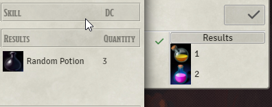

# Beaver's Crafting System

## Work in progress

! Carefully structure will probably change until i finalize this module with version 1.0.0 !, 
so do not start creating tones of recipes already ! The future upgrades might break them.

! breaking change release: 0.1.x -> 0.2.x !

## Features
### Loot subtype Recipe

For this to work you must go to your settings and enter the name of the create Item Dialog.
Default is "Create New Item" obviously you need to adapt if you have a different language.

### Configure subtype Recipe

#### cost: 
you may add costs to the crafting process
#### Ingredients:

You may add Items via drag and drop as Ingredients.
#### skill: 
you may add a skill that is required in the crafting process.
you can enable that costs and ingredients are also payed when the check failed.
#### results:

You may add Items or RollTable via drag and drop as result.
The result is the outcome of a successfull crafting process.
If you add a RollTable you will get quantity amount of rolls on that table not one roll quantity of times.

### Crafting

You can start a crafting process by clicking on a recipe in your inventar 
or throu recipe compendium
- list all recipes that you have permission to see for all items in your world (not compendium)
  - filter available: only those that you have at least one ingredient of any quantity of.
  - filter useable: only those that you have all ingredients in required quantity of.
  - filter by item: only those recipes that uses all items in the filter regardless of quantity.
- you can display details for a Recipe:
  - it will display you an uneditable recipe and shows you which ingredients are missing.
- you can hit the craft button to start a craft process.
  - a craft process will ask for the given skill if any and returns with an result
### Result

You will see a chat message with your result 

## latest features:
### 0.2.x feature add rollTable result
you now can produce a random Potion.
breaking change 0.1.x -> 0.2.x

## Upcoming Changes
### "any" of ingredient
I want to create recipes with "any" xxx e.g. (weapon,mushroom,etc) therefor i may need some new fields in recipe or a new subtype ingredient
### results should include rollTables (done 0.2.x)
I want to create a random potion.
### macro
I want to be able to add macros to recipes.
giving them more flexibility e.g. get damage on certain recipes where you failed your check.
### ingredients/potions/recipes package
The identity of ingredients works best when the item originates from compendium
- I want a compendium package with lots of garbage items (mushrooms etc. that you can drop as loot)
- I want a compendium package with various potions (dnd5e is so borring here)
- I want a compendium package with recipes using the above two as a starter package for other creators.
### hooks for the crafting process
Once the process is stabilized
- I want to create hooks to make live easier for other 
developer that invent recipe packages that needed a little special extra 
- or developers that might extend specials to this module

## Notes
### Currency reorder
When adding costs to your recipe your currency will get exchanged to highest values.
### Items reorder
Actor Items will get merged to stacks in the crafting process. 
(only those that match ingredients or results)

## Credits
Copy organizational structur from midi-qol (gulpfile,package.json,tsconcig.json)