# Beaver's Crafting Module


Recipes for everything your characters can work on over time:
- crafting, brewing, harvesting, mining, fabricating, gathering
- character advancement, tech trees, skill trees, ability trees
- downtime activities, faction or organisation reputation, quest logs, skill training

A recipe can
- require items, features, tools, classes or backgrounds
- consume ingredients and money
- ask for checks (skills, tools, abilities) or simply advance step by step
- grant specific or random items, containers or run macros on success

It works in possibly every system through the [Beaver's System Interface](https://github.com/AngryBeaver/beavers-system-interface) ([list of adaption layers](https://github.com/AngryBeaver/beavers-system-interface/wiki/BSA-x-links)).

**Tested in** (2026-11-27, beavers-crafting 4.16.1, Beaver's System Interface 2.5.0): create recipes of every check
type, craft them from the crafting window, advance them on the actor sheet, results and chat.

| System | System version | Foundry | Adapter |
|---|---|---|---|
| Level Up: Advanced 5th Edition (a5e) | 1.5.3 | 14.368 | bsa-a5e 1.3.0 |
| Call of Cthulhu 7th Edition (CoC7) | 9.2 | 14.368 | built in |
| 3.5e SRD (D35E) | 3.1.0 | 14.368 | bsa-D35E 1.1.0 |
| DnD 4th Edition (dnd4e) | 0.9.3 | 14.368 | bsa-dnd4e 1.3.0 |
| Dungeons & Dragons Fifth Edition (dnd5e) | 6.1.2 | 14.368 | bsa-dnd5e 2.2.0 |
| Fallout: The Roleplaying Game (fallout) | 11.17.1 | 14.368 | bsa-fallout 2.1.0 |
| Pathfinder 1e (pf1) | 11.11 | 13.351 | bsa-pf1 1.2.1 |
| Pathfinder Second Edition (pf2e) | 7.12.2 | 13.351 | bsa-pf2e 1.2.2 |
| Fabula Ultima (projectfu) | 5.0.0 | 14.368 | built in |
| Starfinder First Edition (sfrpg) | 14.0.2 | 14.368 | bsa-sfrpg 1.2.0 |
| Savage Worlds Adventure Edition (swade) | 6.0.4 | 14.368 | bsa-swade 1.3.1 |
| Systems Without Number (swnr) | 2.3.3 | 14.368 | built in |
| Warhammer Fantasy Roleplay 4th / 5th Edition (wfrp4e) | 10.2.0 | 14.368 | bsa-wfrp4e 1.2.2 |

currently no longer tested: Cyberpunk RED (cyberpunk-red-core v0.92.4 needs Foundry 12).

**Playing dnd5e?** Start with the [ready-made recipes](#ready-made-recipes-dnd5e): you get a recipe for every tool of the D&D 2024 rules out of the box.
More recipes come as modules of their own: [Artificer recipes](#artificer-recipes-dnd5e) and [50 potions to brew](#potion-recipes-dnd5e).

## Features
### Crafting
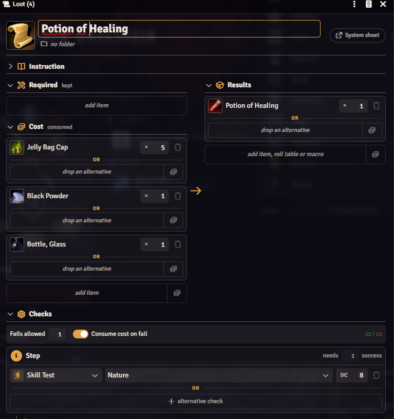

**Create a recipe**

https://github.com/user-attachments/assets/f5e02b8f-ef72-4c76-a622-9aabf0788f51

**Craft it**

https://github.com/user-attachments/assets/6da63c89-439c-4681-9d1c-798b2250eaf1

### Recipes and blueprints
A recipe is either a **Recipe** everyone can use, or a **Blueprint** an actor must learn first; players can ask the
Gamemaster to learn it. See [Recipes and blueprints](#recipes-and-blueprints).

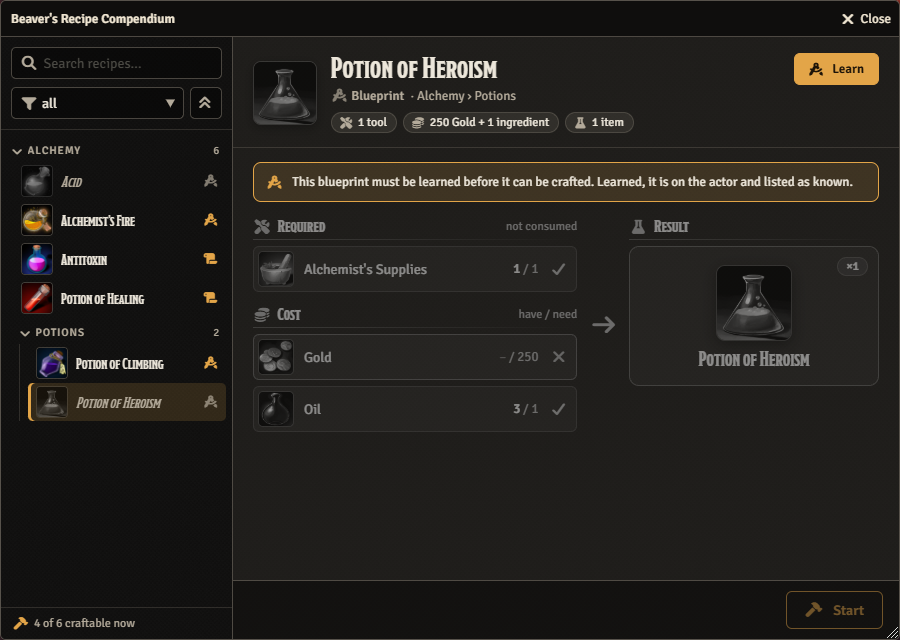

### Downtime activities
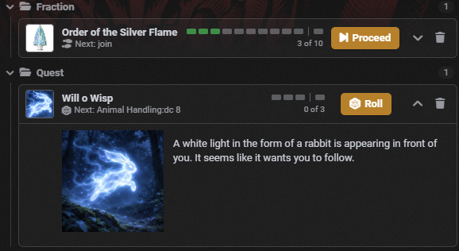
### Containers
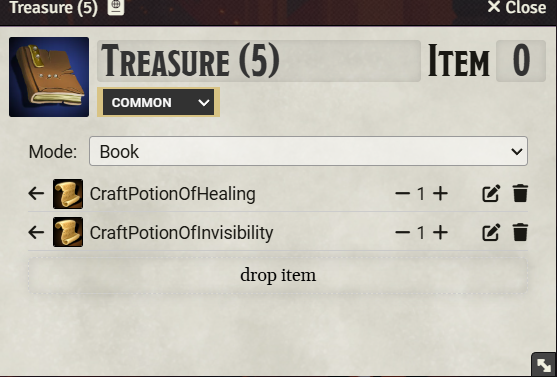

- Recipes can produce containers, including their contents.
- dnd5e: the system's own container type is used.
- Other systems: Beaver's Crafting brings its own container item (experimental).
- Dropping a Beaver's Crafting container onto an actor copies its predefined contents to the actor and puts them into the new container.

## Contents
<!-- TOC -->
* [Create a recipe](#create-a-recipe)
* [The recipe sheet](#the-recipe-sheet)
  * [Instruction](#instruction)
  * [Required](#required)
  * [Cost](#cost)
  * [Results](#results)
  * [Checks](#checks)
  * [Macro](#macro)
* [Crafting](#crafting-1)
  * [Choose a recipe](#choose-a-recipe)
  * [Progress](#progress)
  * [Result](#result)
* [Recipes and blueprints](#recipes-and-blueprints)
* [AnyOf](#anyof)
* [Script](#script)
* [Ready-made recipes (dnd5e)](#ready-made-recipes-dnd5e)
  * [Tool Recipes (dnd5e)](#tool-recipes-dnd5e)
  * [Scribe Spell Scroll (dnd5e)](#scribe-spell-scroll-dnd5e)
  * [Artificer Recipes (dnd5e)](#artificer-recipes-dnd5e)
  * [Potion Recipes (dnd5e)](#potion-recipes-dnd5e)
* [Hooks](#hooks)
* [Settings](#settings)
* [Good to know](#good-to-know)
* [Troubleshooting](#troubleshooting)
* [Credits](#credits)
<!-- TOC -->

## Create a recipe


Create a new item and choose "Recipe" (or "AnyOf") as its type.

If the type is missing, enable the [Create Beaver's Item Button](#create-beavers-item-button) or see [Troubleshooting](#troubleshooting).

Recipes are recognized by the module, whatever item type your system uses for them, and always open in the recipe sheet.
The button **System sheet** in its header opens your system's own item sheet, e.g. for price, weight or description.

## The recipe sheet


The header shows the image, the name, the kind and the folder of the recipe.
- **Kind**: **Recipe** (default) can be crafted by everyone who sees it, a **Blueprint** must be learned first,
  see [Recipes and blueprints](#recipes-and-blueprints).
- The folder groups the recipes in the crafting window and on the actor tab; click it to change it, e.g. `Smithing/Weapons`.

The sheet follows Foundry's light and dark mode. Every section can be folded; players without edit rights see a read-only version.

### Instruction
Flavour text or instructions for the players, e.g. how long the work takes.


### Required
Items that must be present but are not used up: tools, features, classes, backgrounds …
Anything else can be checked with a [Script](#script), e.g. a level or a proficiency.

### Cost
Ingredients and money that are used up.
Anything else can be paid with a [Script](#script), e.g. uses of a feature, spell slots or XP.

### Results
What the crafting gives on success: items, containers, roll tables or macros.
- A roll table with quantity 3 is rolled three times.
- A macro as result runs on success; it gets the same parameters as the recipe macro, see [Output macros](macros.md#output-macros).
- The hammer next to an item marks it as "crafted", see [isCrafted flag](#iscrafted-flag).

For Required, Cost and Results:
- Drag and drop items (from a compendium, see [Good to know](#good-to-know)) into the section.
- Every line is needed (and). Drop an item on the **or** zone below a line to add an alternative: the player then picks **one of** them.
- Click **| coin** at the end of a drop zone to add money; choose the currency in the line.


### Checks
Optional checks the crafting needs, as numbered steps that are done one after another.
- **+ Add step** adds a step; **+ alternative check** adds a check the player can choose instead.
- A step needs a number of successes before the next step starts.
- Check types: skill, ability, tool, or a fixed success without rolling (just progress over time). What is available depends on your system.
- **Fails allowed**: the crafting fails when this many checks fail; 0 means it can never fail.
- **Fails in a row**: a success resets the failed checks, so the crafting only fails after this many fails in a row
  (e.g. "fail three times in a row and the materials are lost").
- **Consume on fail**: whether the cost is lost when the crafting fails.

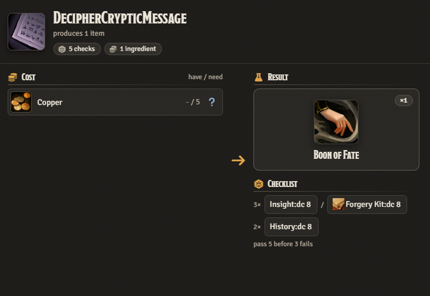

This example means:
- 3 successes in Insight DC 8 or Forgery Kit DC 8,
- then 2 successes in History,
- before 3 fails overall.

### Macro
For advanced users: JavaScript that runs during the crafting, with `result`, `actor` and `recipeData` available.

Plain code runs when the crafting starts. Or write one object with a function per moment, every function is optional:
```js
{
  start() {},                           // the crafting starts
  requiredChosen(component, preview) {},// a requirement is chosen (e.g. by an AnyOf), before anything is checked or paid
  inputChosen(component, preview) {},   // a cost is chosen, before anything is checked or paid
  resultChosen(component, preview) {},  // a result is chosen, before anything is checked or paid
  finish(success) {}                    // the crafting ends, before the results are given
}
```
`inputChosen` and `resultChosen` can change quantities and money; the crafting window shows these changes as a preview (`preview` is `true` there).
`requiredChosen` runs first, so what was chosen for a requirement (e.g. a spell) can set the cost, see the [Scribe Spell Scroll](#scribe-spell-scroll-dnd5e) recipe.
Throwing an error stops the crafting, it counts as failed.

The sheet has an example to insert; more in [Macros](macros.md).

Example: the cost is half the price of the chosen result (dnd5e)
```js
{
  async resultChosen(component, preview) {
    const item = await fromUuid(component.uuid);
    const price = item?.system.price;
    if (!price?.value) return;
    // half the price in copper, rounded up
    const perGold = CONFIG.DND5E.currencies[price.denomination]?.conversion || 1;
    recipeData.currency = {name: "cp", value: Math.ceil(price.value * 100 / perGold / 2)};
  }
}
```

## Crafting
Players find a new tab on their actor sheet.


### Choose a recipe
Click **Craft…** to open the crafting window.


- It lists every recipe in your world that you may see (not those in compendiums).
- Filters:
  - **available**: you have at least one of the ingredients
  - **usable**: you have all ingredients in the needed quantity
  - **known**: the recipe is in your inventory (learned)
  - **by item**: drop items to see only recipes using all of them
- Each recipe shows its kind, a scroll (recipe) or a compass (blueprint): yellow when you can craft it now, grey when not.
  Blueprints you have not learned are greyed, see [Recipes and blueprints](#recipes-and-blueprints).
- The recipe shows what you have and what is missing.
- Where a recipe offers a choice ("one of", AnyOf), make it in the window; it can be undone.
- **Start** begins the crafting.

### Progress
The tab lists everything you are working on, grouped by folder; click a name for details.

If the recipe has checks, the needed resources are locked and you advance by clicking the progress:

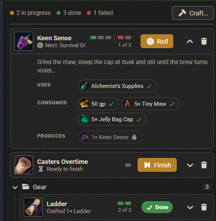

At 100% you get the results. If the crafting fails, you get nothing.

### Result
A chat message shows the result.


Items created or updated by a successful crafting are flagged with `flags.beavers-crafting.isCrafted = true`.

## Recipes and blueprints
A recipe item on an actor is a recipe the actor **knows**. The kind (in the recipe sheet, under the name) decides
whether that matters:
- **Recipe** (default): everyone who sees it in the world can craft it, as before.
- **Blueprint**: everyone who sees it finds it in the crafting window, greyed: it must be learned before it can be crafted.

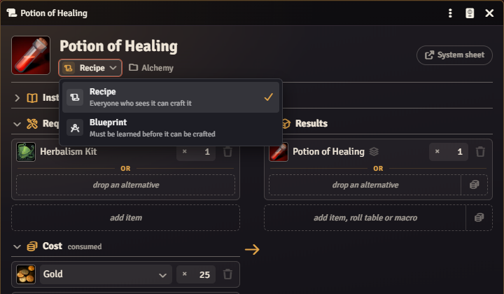

In the crafting window each recipe shows its kind, a scroll (Recipe) or a compass (Blueprint): yellow when it can be
crafted now, grey when not. A blueprint the actor has not learned is greyed, with **Learn** at the top right.


Who sees a world recipe is up to its Foundry permissions, as before.

**Learn**: the recipe lands on the actor, by
- dragging it onto the actor (from the world or a compendium)
- **Learn** in the crafting window (top right), see below
- a recipe whose result is a recipe (e.g. a book that is consumed)
- the API: `game["beavers-crafting"].RecipeKnowledge.learn(actor, uuid)`

A recipe is learned once: when the actor already knows it (same source, or without a recorded source the same name),
it is refused with a message.

**Learn in the crafting window**: select a greyed blueprint and click **Learn** (top right).
- The Gamemaster learns it at once.
- Players: setting **Learning recipes**
  - **Gamemaster approves** (default): the window shows "Waiting for approval", the Gamemasters get a whispered chat
    card with **Allow** / **Reject**. The player gets the answer as a popup, also when they were offline meanwhile.
    The request is kept on the actor until it is answered.
  - **Players learn directly**: like the Gamemaster.

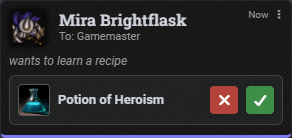

**Forget**: **Forget** in the crafting window (top right, at once) or removing the recipe item from the actor.

## AnyOf
An AnyOf is an ingredient that stands for "any item that …", e.g. any weapon or any herb.
Its macro gets an `item` and returns `true` when the item matches.

```js
return item.name.startsWith("Test")   // any item whose name starts with "Test"
return item.type === "weapon"         // any weapon (if your system has this type)
```
The attributes of an item depend on your system. To look at them, use `console.log(item); return false` and open the console (F12).

Test your AnyOf by dropping an item on its drop area and clicking "test item".

**Without code:** with the module [Item Tags](https://foundryvtt.com/packages/item-tags) you can filter by tags:
`return ItemTags.Check(item, ['metal','sword'])` ([API](https://modules.zoty.dev/itemTags/apiReference.html)).

**When crafting**, choose which item is used for the AnyOf:
- click it to pick from your matching items,

  
- or drag an item from your inventory onto it.

  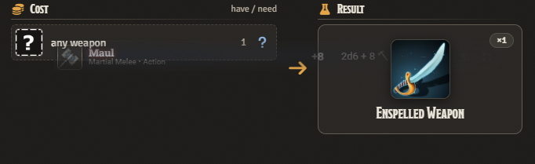
  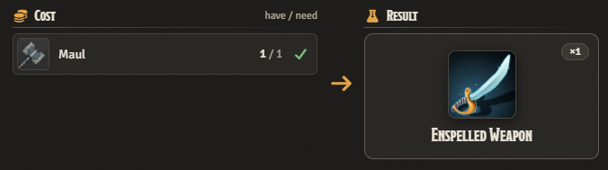

An AnyOf that is not chosen yet asks before the crafting starts. Selecting the recipe again starts over.

## Script
A Script is an item (like AnyOf) with a small script. Create it with the item type "Script" and drop it into a recipe:
- **Required** (needs `check()`): a requirement that is not an item, e.g. a level or a proficiency.
- **Cost** (needs `pay()`): a cost that is not an item or money, e.g. uses of a feature.

| function | returns / does |
|---|---|
| `check(quantity)` | `true` when it is there in this quantity (or can be paid); `false` or a text with the reason when not. Optional for a cost. |
| `pay(quantity)` | pays the cost, at the moment the other costs are paid |
| `refund(quantity)` | optional: gives it back when a failed crafting returns its costs |

Like an item, a Script has a quantity in the recipe; the same Script several times in a section counts as one with the sum.
A script that does not use `quantity` works as before. A Script with `pay()` can also be a requirement: then only `check()` runs,
e.g. "at least one use left" without using it up.

Available are `actor` (who crafts) and `recipe`. `check()` runs whenever the recipe is evaluated (recipe list, crafting window, start), so it must only check, never change anything.
Test the check by dropping an actor on the script's sheet.

**Example: uses of a feature as a cost** (dnd5e, the feature needs its uses set up, e.g. "Int modifier per long rest")
```js
{
  check(quantity) {
    const feature = actor.items.find(i => i.name === "Tinker's Magic");
    if (!feature?.system.uses?.max) return "needs the feature Tinker's Magic with uses";
    return feature.system.uses.value >= quantity || `needs ${quantity} uses of Tinker's Magic`;
  },
  pay(quantity) {
    const feature = actor.items.find(i => i.name === "Tinker's Magic");
    return feature.update({"system.uses.spent": feature.system.uses.spent + quantity});
  },
  refund(quantity) {
    const feature = actor.items.find(i => i.name === "Tinker's Magic");
    return feature.update({"system.uses.spent": Math.max(0, feature.system.uses.spent - quantity)});
  }
}
```
dnd5e calculates `uses.value` (left) from `uses.max` and `uses.spent` (used): change `spent`. A long rest resets it, when the feature recovers on a long rest.
Other systems keep uses elsewhere: look at the item with `console.log(actor.items.getName("Tinker's Magic"))`.

More examples in [macros.md](macros.md#script-requirements).

## Ready-made recipes (dnd5e)
With dnd5e you can import existing recipes instead of creating your own.

### Tool Recipes (dnd5e)
This module includes the compendium **D&D 2024 Tool Recipes**: one recipe for every tool that can craft something by the D&D 2024 rules, e.g. "Smith's Tools Recipes".
1. Import the recipes into your world (they go into the folder "Tools").
2. Give the players permission to see them.

When crafting, the player chooses what to make from everything the tool can craft.
- Proficiency with the tool is needed.
- The raw materials cost half the price of the chosen item.
- The work is a "Day of work" step, advanced once per day of work: one day per 10 GP of the item's price (at least one).
- The items come from the Player's Handbook when that module is active, otherwise from the free dnd5e equipment (SRD 5.2).

### Scribe Spell Scroll (dnd5e)
The compendium **D&D 2024 Tool Recipes** also has the recipe **Scribe Spell Scroll** (folder "Tools"), by the rules of the Player's Handbook 2024.
- Proficiency in Arcana or with Calligrapher's Supplies is needed; no spell slot is used.
- Choose a spell you have prepared ("Prepared spell"; cantrips and spells that are always available count as well).
- The spell's level sets the cost and the days of work, from 15 GP and 1 day (cantrip) up to 50,000 GP and 120 days (level 9).
- On success the scroll is made from the spell, with the scribe's spell save DC and attack bonus.
- Two costs in gold: the scribing (by the level) and, when the spell consumes Material components with a price (e.g. Revivify's diamonds), their price. Other components are not part of the recipe, have them at hand.

It shows how a requirement can drive a recipe: the recipe macro `requiredChosen` sets the cost and the days for the chosen
spell, `finish` creates the scroll.

### Artificer Recipes (dnd5e)
The D&D 2024 Artificer recipes are a module of their own:
[Beaver's Artificer's Crafting](https://github.com/AngryBeaver/beavers-artificers-crafting).
- Tinker's Magic, with its uses per long rest counted.
- Replicate Magic Item: 56 plans by Artificer level, items per long rest and held at once, the oldest item vanishes.

### Potion Recipes (dnd5e)
50 magical potions with their recipes are a module of their own:
[Beaver's Potions](https://github.com/AngryBeaver/beavers-potions) (3.0.0, Foundry 14, dnd5e 6).
- 50 potions that work with dnd5e alone: drinking one applies its effects.
- 22 mushrooms and Magical Essence as ingredients, with "Any Mushroom" / "Any Potion" choices.
- 58 recipes: one for each of the 50 potions, the 4 SRD healing potions, "Gather Essence" (a potion turned into Magical Essence) and 3 random potions by rarity.

## Hooks
### beavers-crafting.start
Fires for every crafting after all components are chosen and before anything is processed.
The recipe can be changed here to change the crafting.
```js
Hooks.on("beavers-crafting.start", (recipe) => {
  console.log(recipe);
});
```

### beavers-crafting.preLearn
Fires before an actor learns a recipe, whatever the way (drag & drop, Learn, crafting, API).
Return `false` to refuse it; show your own message why.
```js
Hooks.on("beavers-crafting.preLearn", (actor, recipeItem) => {
  if (tooManyRecipes(actor)) {
    ui.notifications.warn(`${actor.name} can't learn more recipes.`);
    return false;
  }
});
```

### beavers-crafting.forget
Fires after a recipe was removed from an actor (by Forget or any other way), on the client that removed it.
```js
Hooks.on("beavers-crafting.forget", (actor, recipeItem) => {
  // e.g. remove what was made with it
});
```

## Settings
### Create Beaver's Item Button
Adds a button to the Item Directory to create Beaver's Crafting items (Recipe, AnyOf) directly (Foundry v12+).
Enable **Add Beaver's Item Button** in the module settings.


### isCrafted flag
Tells crafted items apart from bought or found ones, e.g. a recipe that only accepts crafted daggers. Disabled by default.
- **Full**: a crafted item never counts as a normal one; recipes need to say explicitly that they accept crafted items.
- **Partial**: recipes can require crafted items, and all other recipes accept crafted items as well. Non-crafted items are used first.

Crafted items are marked with an icon.

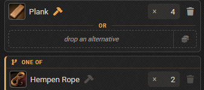

### Draggable chat result
Results in the chat message can be dragged to another character.
- Only one item is copied each time.
- This creates items beyond what the recipe gave.
- Only items can be dragged.
- Copied items are not flagged as crafted.

### Currency exchange
Money is exchanged automatically (e.g. a gold coin is changed to pay 5 silver).
Turn it off to require the exact coins.

## Good to know
- **Recipes store references, not copies.** If you change an item later, the recipe uses the changed item.
- **Where you take the items from matters:**
  - Never take them from an actor.
  - Items of your world work, but only in that world.
  - Items from a compendium work in every world that has the same compendium, so recipes can be exported and imported.
- **Stacks:** items on the actor that match ingredients or results are merged into stacks while crafting.

## Troubleshooting

### "Recipe" is missing when creating an item
The module adds Recipe and AnyOf to the item creation window. It finds that window by its title, which is "Create New Item" in English.


**Solutions, from the easiest:**
1. Enable the [Create Beaver's Item Button](#create-beavers-item-button) (Foundry v12+), which does not need the window at all.
2. Enter the title of your item creation window (in your language) in the module settings.

   
3. If your system changes the title, enable capturing in the settings:

   

   A bullseye  appears in window headers. Click it in the item creation window; the module remembers that window from then on.

**Why so complicated?** Foundry has no way for a module to add an item type to every system (not even the [module sub-types](https://foundryvtt.com/article/module-sub-types/) since v11), so the module adds the entries to the window when it opens.

## Credits
- Brazilian Portuguese translation by [Andersants](https://github.com/Andersants)
- French translation by [Michel](https://github.com/jehan-michel)
- Module icon "Anvil impact" by [Lorc](https://lorcblog.blogspot.com) from [game-icons.net](https://game-icons.net/1x1/lorc/anvil-impact.html), licensed under [CC BY 3.0](https://creativecommons.org/licenses/by/3.0/)

## License
This work includes material from the System Reference Document 5.2 ("SRD 5.2") by Wizards of the Coast LLC, available at https://www.dndbeyond.com/srd. The SRD 5.2 is licensed under the Creative Commons Attribution 4.0 International License, available at https://creativecommons.org/licenses/by/4.0/legalcode.
