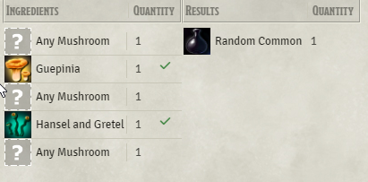

# Beaver's Crafting Module


This module is for:
- Crafting, brewing, harvesting, mining, fabricating, gathering
- Character advancement, tech tree, skill tree, ability tree
- Downtime activities, factions / organisation reputation, quest logs, Skill Training
  
by:
- optionally granting specific or random items on success
- optionally consuming ingredients and money
- optionally requiring features, tools, classes, backgrounds
- optionally tracking your progress by optionally testing (skills, tools, abilities) or just advancing it.

in possibly all Systems: ([List of adaption layers](https://github.com/AngryBeaver/beavers-system-interface/wiki/BSA-x-links))

## Features
### Crafting


[full Length Video](https://www.youtube.com/watch?v=t3YGk8uFK0w)
### Character advancement

### DownTimeActivities


## TOC
<!-- TOC -->
* [Beaver's Crafting Module](#beavers-crafting-module)
  * [Features](#features)
    * [Crafting](#crafting)
    * [Character advancement](#character-advancement)
    * [DownTimeActivities](#downtimeactivities)
  * [TOC](#toc)
  * [HowTo](#howto)
    * [Create Recipes](#create-recipes)
    * [Configure Recipe](#configure-recipe)
      * [requires:](#requires-)
      * [costs:](#costs-)
      * [tests:](#tests-)
        * [TestSection](#testsection)
      * [results:](#results-)
      * [instruction:](#instruction-)
      * [folder:](#folder-)
      * [macro:](#macro-)
    * [Executing Recipes](#executing-recipes)
      * [add](#add)
        * [Recipe Compendium](#recipe-compendium)
          * [or Condition](#or-condition)
      * [list](#list)
      * [advancement](#advancement)
        * [result](#result)
  * [AnyOf](#anyof)
    * [Example](#example)
      * [ItemTags](#itemtags)
    * [test](#test)
    * [customize Recipes](#customize-recipes)
      * [Drag And Drop](#drag-and-drop)
      * [Select available](#select-available)
      * [reset](#reset)
  * [Examples](#examples)
    * [Ingredients](#ingredients)
    * [Recipes](#recipes)
  * [Settings](#settings)
    * [3.3.x isCrafted flag](#33x-iscrafted-flag)
  * [Notes](#notes)
    * [Currency reorder](#currency-reorder)
    * [Items reorder](#items-reorder)
    * [ItemReference](#itemreference)
  * [Troubleshooting](#troubleshooting)
    * [Dont show "RECIPE" in item menu](#dont-show--recipe--in-item-menu)
      * [Problem:](#problem-)
      * [Solution:](#solution-)
      * [Explanation:](#explanation-)
  * [Credits](#credits)
<!-- TOC -->

## HowTo
### Create Recipes


For this to work you must go to your settings and enter the name of the create Item Dialog.
Default is "Create New Item" obviously you need to adapt if you have a different language.

### Configure Recipe

#### requires:
you may add required items to your recipe via drag and drop. 
Required items are not consumed and could be anything from classes to backgrounds.
#### costs: 
You may add costs to your recipe named ingredients. This can either be currency or items
You may add items via drag and drop.
#### tests: 
you may add steps or tests that are needed in the process.
When adding tests you can define that your progress can fail on certain amount of failed tests.
You can configure that costs are consumed or returned when you fail your progress.

Tests consisting of one or more TestSections.
##### TestSection

In ech TestSection you need to hit a given amount of successes specified by "hits" in the TestSection default is 1.

Each TestSection consist of one or more TestOption you can add as choice .
There are up to 4 types of TestOptions.
- skill check
- ability check (not sure how to model this in pf2e (help wanted! bsa-pf2e module))
- tool check (not sure how to model this in pf2e (help wanted! bsa-pf2e module))
- fixed hit
  - just progress without any check.

You can add multiple times the same type of TestOption for example to choose from diffrent skills.
Your Recipe can fail if you reach the specified "fails" default is 1. If you set the fails to 0 your recipe can never fail.
You can also specify if your costs will get consumed when your recipe fails.
e.g.


meaning:
- you need 3 success in:insight skill dc 8 or forgery kit dc 8
- and thereafter 2 success in history
- before you have 3 fails overall.

#### results:
You may add Items or RollTable via drag and drop as result of your process.
You will receive the result at the end of the progress, if your progress was successfully.
If you add a RollTable you will get quantity amount of rolls on that table not one roll quantity of times.
#### instruction:


You may add flavour text to your "recipe".
Make sure to hit the save button.
#### folder:
You may add a folder structure to group your progresses on your actor tab.
#### macro:
Advanced user may use the optional recipe macro that gets executed during the crafting process.
see [RecipeMacro](https://github.com/AngryBeaver/beavers-crafting/blob/main/macros.md)

### Executing Recipes
On your actor-sheet you will find a new tab.
#### add
Initially your sheet will be blank except for the add button.
you can add a new crafting process by clicking on +Add,  which will open the [Recipe Compendium](#recipe-compendium).
##### Recipe Compendium


- list all recipes that you have permission to see for all items in your world (not compendium)
  - filter available: only those that you have at least one ingredient of any quantity of.
  - filter useable: only those that you have all ingredients in required quantity of.
  - filter own : only those that you personally have in your inventory
  - filter by item: only those recipes that uses all items in the filter regardless of quantity.
- you can display details for a Recipe:
  - it will display you an uneditable recipe and shows you which ingredients are missing.
- you can hit the start button to start a process.
  - a process will ask for the given skill if any and returns with a result

###### or Condition

Some recipe can have "or conditions" for required, cost and result items.
You can choose one of those or conditions in the RecipeCompendium.

#### list


It lists all your progress with the various recipes you are currently interacting with.

You can show details to each progress by clicking on the progress-name.

#### advancement
if your recipe has a test/progress involved you can advance it on this tab.

Your process will start by locking the resources needed.
you can advance or test your progress by clicking on the progress column:


when your progress ends by reaching 100% success you will be rewarded with the results of the recipe.
or nothing when you fail.
##### result


You will see a chat message with your result

Items updated or created in a successfull crafting process are flagged:
````
flags.beavers-crafting.isCrafted = true
````

## AnyOf
AnyOf is an Item that is intended to be used as ingredient to create recipes that do not need a specific ingredient but any ingredient of... e.g. specific type.

Therefor AnyOf Item has an input field to write a macro code that gets executed when a recipe is checked for its ingredients.
The macro has "item" as input and should return boolean as output. The macro will test if the given item meets the conditions of the AnyOf Ingredient.

### Example
To understand the intension of this feature you can use this as examples:

````return item.name.startsWith("Test")```` any item that has a name that starts with "Test"

````return item.type === "weapon" ```` any item of type weapon (if weapon is a type in your system)
The attributes of item depend on your system. To find out what attributes your item has you can test with
````console.log(item); return false ````. When you hit f12 the item document structure should be copied to your logs when ever you test this anyOf.

#### ItemTags
For people with 0 code experience to better filter the item AnyOf we point out the [ItemTags](https://foundryvtt.com/packages/item-tags) a simple and easy module to use and integrates perfectly with this feature all you have to do is insert the following macro:
`return ItemTags.Check(item, ['tag1','tag2'])`
and modify the tag array as you want ['metal','sword'] or ['metal','bow'] etc., major details about this module are on this [API](https://modules.zoty.dev/itemTags/apiReference.html)
this allows you to "draconianly" filter your components with little and definitely more dynamic effort.

### test
You can test your AnyOf Conditions by dropping an item in the dropArea and hit the "test item" button.

### customize Recipes
When you use a recipe with AnyOf you can customize it and by doing so define what specific ingredients you finally want to use for this recipe.

#### Drag And Drop




drag and drop an ingredient (e.g. from your inventar) to "anyOf" ingredient within your recipeCompendium.
#### Select available

clicking the AnyOf will popup a multiple choice dialog of available matching items you can choose from.

It will automatically check if that new ingredient is available in that quantity. 

none customized AnyOf ingredients will popup a multiple choice dialog of available matching items before starting
#### reset
when you reselect the recipe it will remove your customization and start over with unconfigured anyOf Items again.

## Hooks
### beavers-crafting.start
This is fired for all crafting processes directly 
after all components are selected and before anything is actually processed.
````
Hooks.on("beavers-crafting.start", (recipe) => {
  console.log(recipe);  
});
````
Parameters
- Recipe as reference: You can change the crafting process by manipulating the recipe parameter.

## Examples
The easiest way to get started with this module is with some examples.

### Ingredients
This module provides an example ingredient compendium for dnd5e. that can be used with your recipes.


### Recipes
You can find some example recipes for potions (dnd5e) in the companion module beavers-potions
- Install companion module [Beavers-potions](https://github.com/AngryBeaver/beavers-potions)
- import the recipes into your world 
- grant permission to the users you want to have access to it.


Every Character will now have access to 50+ recipes to brew potions.

## Settings
- Some Settings are currently only available in dnd5e

- You can configure the tool list your recipes can select from. 
(however if you do you might risk incompatibility to others, if the list is missing some default dnd5e tools tell me so)

### 3.3.x isCrafted flag
This module now tracks a isCrafted flag on items.
It will only be usefull if you want a crafting system that needs to differentiate between crafted and non crafted items.
E.g. you want to create recipes that will only work with crafted daggers not bought daggers.
Per default this setting is disabled. You can enable it in the settings to either full mode or partial mode.
- In full mode a crafted item is never a normal item. e.g. you need to explicitly make recipes that works with crafted and non crafted items.
- In partial mode you can create recipes that needs crafted items only but all recipes without crafted items would also accept crafted items.
  You will use non crafted items before crafted ones.


When this feature is enabled crafted items will be marked with an icon.


## Notes
### Currency reorder
When adding costs to your recipe your currency will get exchanged to highest values.
You can however turn off currencyExchange then you need to have the exact currency values.
### Items reorder
Actor Items will get merged to stacks in the crafting process. 
(only those that match ingredients or results)
### ItemReference
The recipes do not store an item but a reference to the item. You can manipulate your items afterward the recipe always refers to the actual item.

When you create recipes be carefully from where you pull your results/costs/requires items. 
- Do not pull items from actors !
- You might pull items form your imported world items, if you do your recipe will work perfectly within your world. 
- You should pull items from compendium ! This way your recipe can be exported/imported to other worlds as long as those worlds have the same compendiums._


## Troubleshooting
### Dont show "RECIPE" in item menu
#### Problem: 
When creating new Items the drop down menu does not have Recipe or AnyOf.
#### Solution: 
You probably have a diffrent language as english you need to type in the exact title of the item creation window in the settings:
default is english "Create New Item" 

.
#### Explanation:
In V10 it is not possible that a module really add a new item types into a system. So beavers-crafting fake it by listening to an event that opens windows and when the window is 
the Item Creation Window it adds item types to the drop down list. Yes that is evil and has high risks to break at somepoint but as said there is no other possiblity.
To filter the right window the module uses the title of the window as there is no real good identification for it and yes I know the title might change in diffrent languages thats why i also added the configuration field.


## Credits
Copy organizational structur from midi-qol (gulpfile,package.json,tsconcig.json)
