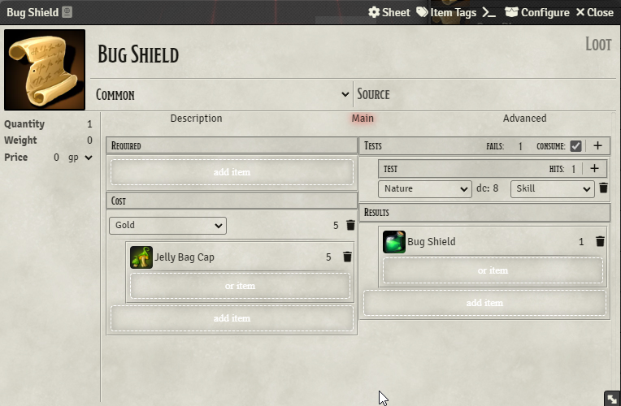

# Beaver's Crafting Module
With this module you can create recipes to craft items. E.g. a bunch of mushrooms to brew a potion. Specifically you can use it for crafting, brewing, harvesting, mining, fabricating, gathering specific or random items by optionally consuming ingredients and money and optionally requireing features, tools, classes, backgrounds and skill checks. 


#### possible breaking change! 0.7.1 release
see changelog.md for details.
## Features

### Loot subtype Recipe


For this to work you must go to your settings and enter the name of the create Item Dialog.
Default is "Create New Item" obviously you need to adapt if you have a different language.

### Configure subtype Recipe


#### attendants: optional (0.7.x)
you may add an attendant the crafting process requires but is not consumed. (default disabled)
#### tool: optional (0.5.x)
you may add a tool the crafting process requires. (default disabled)
#### cost: 
you may add costs to the crafting process
#### Ingredients:
You may add Items via drag and drop as Ingredients.
#### skill: 
you may add a skill that is required in the crafting process.
you can enable that costs and ingredients are also payed when the check failed.
#### results:
You may add Items or RollTable via drag and drop as result.
The result is the outcome of a successfull crafting process.
If you add a RollTable you will get quantity amount of rolls on that table not one roll quantity of times.
#### advanced Tab:
Advanced user may use the optional recipe macro that gets executed during the crafting process.
see[RecipeMacro](https://github.com/AngryBeaver/beavers-crafting/blob/main/macros.md)

#### Usage
- When you create recipes be carfully from where you pull your results/ingredients items. The recipes do not store an item but a reference to the item.
- Do not pull items from actor !
- You might pull items form your imported world items, if you do your recipe will work perfectly within your world. You can manipulate your items afterward the recipe always refers to the actual item.
- You can pull items from compendium (preferred). This way your recipe can be exported/imported to other worlds as long as those worlds have the same compendiums.

### Crafting
You can start a crafting process by clicking on a recipe in your inventory 
or open the recipe Compendium

#### Recipe Compendium


- list all recipes that you have permission to see for all items in your world (not compendium)
  - filter available: only those that you have at least one ingredient of any quantity of.
  - filter useable: only those that you have all ingredients in required quantity of.
  - filter own : only those that you personally have in your inventory
  - filter by item: only those recipes that uses all items in the filter regardless of quantity.
- you can display details for a Recipe:
  - it will display you an uneditable recipe and shows you which ingredients are missing.
- you can hit the craft button to start a craft process.
  - a craft process will ask for the given skill if any and returns with a result
### Result


You will see a chat message with your result

### AnyOf
AnyOf is an Item that is intended to be used as ingredient to create recipes that do not need a specific ingredient but any ingredient of... e.g. specific type.

Therefor AnyOf Item has an input field to write a macro code that gets executed when a recipe is checked for its ingredients.
The macro has "item" as input and should return boolean as output. The macro will test if the given item hits the conditions of the AnyOf Ingredient.

You can test your AnyOf Conditions by dropping an item in the dropArea and hit the "test item" button.

To understand the intension of this feature you can have a look at the provided examples:

- In the compendium "ingredients" you find an "Any Mushroom" example:
````return item.system.source === "Ingredients.Mushroom"````
- In the compendium "recipes" you find a "Random Potion" example that uses Any 5 Mushrooms to produce a random potion.

When you use a recipe with AnyOf you can customize it and by doing so define what specific ingredients you want to use for this recipe.


- drag and drop an ingredient (e.g. from your inventar) to "anyOf" ingredient within your recipeCompendium.
- it will automatically check if that new ingredient is available in that quantity.
- it will stack same (identity) ingredients.
- when you reselect the recipe it will remove your customization and start over with anyOf Items again.
- none customized AnyOf ingredients will consume a random fitting ingredient of your inventory.

### Compendiums
This module comes with some example compendiums.
#### Ingredients


You do not need to import those just drag and drop them into your recipes or use the recipe compendium.
#### Potions


You do not need to import those just drag and drop them into your recipes or use the recipe compendium.
#### RandomTable


You do not need to import those just drag and drop them into your recipes or use the recipe compendium.
#### Recipes


You need to import them and then grant permission to the users you want to have access to it.
The recipecompendium will only show the recipes the user has access to.

### Settings
- You can enable or disable attendants for recipes feature 0.7.x default it is disabled.


- You can enable or disable tools for recipes feature 0.5.x default it is disabled.
- You can configure the tool list your recipes can select from. 
(however if you do you might risk incompatibility to others, if the list is missing some default dnd5e tools tell me so)

## Latest features:
have a look at the changelog.md
### 1.0.x optional macro
you can further customize your recipes with any additions that are not natively supported for recipes. see [Macros](#Macros)
### 0.7.x optional attendants
you recipe can now depend on attendants that are required in the craft process but are not consumed. like class, race, background, tools etc...
### 0.6.x customized AnyOf
you now can customize recipes with anyOf Ingredients.
### 0.5.x optional tool
you now can use tools, if you do not have the tool you dont get a check you simple fail and your ingredients won't vanish.
### 0.4.x starter compendiums,
you now can use items directly from compendium,
module comes with 4 compendiums ingredients,rolltables,potions and recipes
### 0.3.x initial anyOf ingredient
you now can have anyOf ingredients
breaking change 0.2.x -> 0.3.x
### 0.2.x rollTable result
you now can produce a random Potion.
breaking change 0.1.x -> 0.2.x

## Notes
### Currency reorder
When adding costs to your recipe your currency will get exchanged to highest values.
### Items reorder
Actor Items will get merged to stacks in the crafting process. 
(only those that match ingredients or results)
### Work in progress
! Carefully structure might change until i finalize this module with version 1.0.0 !,

## Credits
Copy organizational structur from midi-qol (gulpfile,package.json,tsconcig.json)
