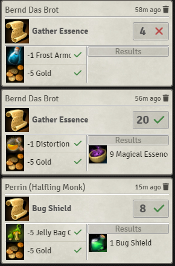
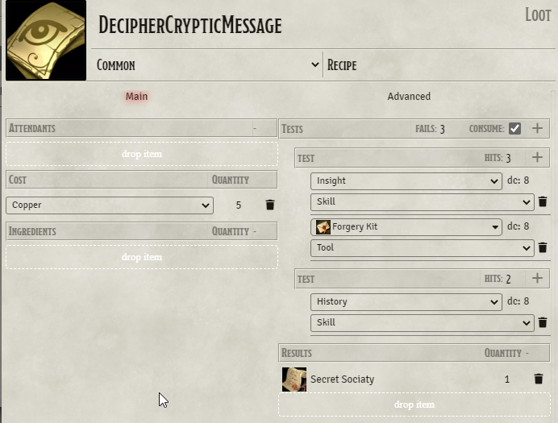

# Beaver's Crafting Module


## Features

### demoVideo
https://www.youtube.com/watch?v=t3YGk8uFK0w

With this module you can create recipes to craft items. E.g. a bunch of mushrooms to brew a potion.

You can use it for:
 - crafting, brewing, harvesting, mining, farbicating, gathering
 - skillChallenges
 - tracking downtime activities
 - progressing quests
 
by:
- optionally granting specific or random items on success
- optionally consuming ingredients and money 
- optionally requireing features, tools, classes, backgrounds
- optionally tracking your progress by optionally testing (skills, tools, abilities) or just advanceing it.

### Loot subtype Recipe

For this to work you must go to your settings and enter the name of the create Item Dialog.
Default is "Create New Item" obviously you need to adapt if you have a different language.

### Configure subtype Recipe


#### attendants: optional (0.7.x)
you may add an attendant the crafting process requires but is not consumed. (default disabled)
#### cost: 
you may add costs to the crafting process
#### Ingredients:
You may add Items via drag and drop as Ingredients.
#### tests: (3.0.x)
you may add tests that are required in the crafting process.
You can enable that costs and ingredients are also consumed when you fail your progress.
You fail your progress if you miss equally often then a specified amount of "fails".
#### results:
You may add Items or RollTable via drag and drop as result.
The result is the outcome of a successfull crafting process.
If you add a RollTable you will get quantity amount of rolls on that table not one roll quantity of times.
#### advanced Tab:
Advanced user may use the optional recipe macro that gets executed during the crafting process.
see[RecipeMacro](https://github.com/AngryBeaver/beavers-crafting/blob/main/macros.md)

#### Usage
- When you create recipes be carefully from where you pull your results/ingredients items. The recipes do not store an item but a reference to the item.
- Do not pull items from actor !
- You might pull items form your imported world items, if you do your recipe will work perfectly within your world. You can manipulate your items afterward the recipe always refers to the actual item.
- You can pull items from compendium (preferred). This way your recipe can be exported/imported to other worlds as long as those worlds have the same compendiums.

### Crafting
You can start a crafting process on the crafting tab of your Charsheet (new 2.x)


Here you can see all crafting process you are acutally in or that are completed.
#### +add
you can add a new crafting process by clicking on +Add,  which will open the recipe Compendium.
#### timeToCraft
When you have configured TimeToCraft to interaction. Your crafting process will start by locking the resources needed.
You then can click in the status field to finalize the crafting process. 
This will grant your results and maybe unlocks your resources if they are not consumed in the process.

Alternatively you can enable Header Buttons in the configuration to open up the recipeCompendium (deprecated 2.x)


Or can start a crafting process by clicking on a recipe in your inventory (deprecated 2.x)

#### Recipe Compendium


- list all recipes that you have permission to see for all items in your world (not compendium)
  - filter available: only those that you have at least one ingredient of any quantity of.
  - filter useable: only those that you have all ingredients in required quantity of.
  - filter own : only those that you personally have in your inventory
  - filter by item: only those recipes that uses all items in the filter regardless of quantity.
- you can display details for a Recipe:
  - it will display you an uneditable recipe and shows you which ingredients are missing.
- you can hit the craft button to start a craft process.
  - a craft process will ask for the given skill if any and returns with a result

### Result



You will see a chat message with your result

Items updated or created in a successfull crafting process are flagged:
````
flags.beavers-crafting.isCrafted = true
````


### AnyOf

AnyOf is an Item that is intended to be used as ingredient to create recipes that do not need a specific ingredient but any ingredient of... e.g. specific type.

Therefor AnyOf Item has an input field to write a macro code that gets executed when a recipe is checked for its ingredients.
The macro has "item" as input and should return boolean as output. The macro will test if the given item meets the conditions of the AnyOf Ingredient.

You can test your AnyOf Conditions by dropping an item in the dropArea and hit the "test item" button.

To understand the intension of this feature you can use this as examples:

````return item.name.startsWith("Test")```` any item that has a name that starts with "Test"
````return item.type === "weapon" ```` any item of type weapon (if weapon is a type in your system)

The attributes of item depend on your system. To find out what attributes your item has you can test with 
````console.log(item); return false ````. When you hit f12 the item document structure should be copied to your logs when ever you test this anyOf.

**For people with 0 code experience** to better filter the item AnyOf we point out the [ItemTags](https://foundryvtt.com/packages/item-tags) a simple and easy module to use and integrates perfectly with this feature all you have to do is insert the following macro:

`return ItemTags.Check(item, ['tag1','tag2'])`

and modify the tag array as you want ['metal','sword'] or ['metal','bow'] etc., major details about this module are on this [API](https://modules.zoty.dev/itemTags/apiReference.html)

this allows you to "draconianly" filter your components with little and definitely more dynamic effort.

When you use a recipe with AnyOf you can customize it and by doing so define what specific ingredients you want to use for this recipe.


**Drag And Drop**

- drag and drop an ingredient (e.g. from your inventar) to "anyOf" ingredient within your recipeCompendium.
**ChoiceWindow (3.2.x)**
- clicking the AnyOf will popup a multiple choice dialog of available matching items you can choose from.

- it will automatically check if that new ingredient is available in that quantity.
- none customized AnyOf ingredients will popup a multiple choice dialog of available matching items before starting
- when you reselect the recipe it will remove your customization and start over with anyOf Items again.

### Simple Or Condition (3.2.x)

Your recipe can have "or conditions" for required, cost and result items. 
You can choose one of those or conditions in the RecipeCompendium by selecting on checkbox.


## Examples
The easiest way to get started with this module is with some examples.

### Ingredients
This module provides a compendium for some example Ingredients, that can be used with your recipes.


### Recipes
You can find some example recipes for potions in the companion module beavers-potions
- Install companion module [Beavers-potions](https://github.com/AngryBeaver/beavers-potions)
- import the recipes into your world 
- grant permission to the users you want to have access to it.


Every Character will now have access to 50+ recipes to brew potions.

### Settings
- You can enable or disable attendants for recipes feature 0.7.x default it is disabled.


- You can enable or disable tools for recipes feature 0.5.x default it is disabled.
- You can configure the tool list your recipes can select from. 
(however if you do you might risk incompatibility to others, if the list is missing some default dnd5e tools tell me so)

## Latest features:
have a look at the changelog.md
### 3.3.x isCrafted flag
This module now tracks a isCrafted flag on items. 
It will only be usefull if you want a crafting system that needs to differentiate between crafted and non crafted items.
E.g. you want to create recipes that will only work with crafted daggers not bought daggers.
Per default this setting is disabled. You can enable it in the settings to either full mode or partial mode.
- In full mode a crafted item is never a normal item. e.g. you need to explicitly make recipes that works with crafted and non crafted items.
- In partial mode you can create recipes that needs crafted items only but all recipes without crafted items would also accept crafted items.
You will use non crafted items before crafted ones.


When this feature is enabled crafted items will be marked with an icon.

### 3.0.x progress tracking and multiple tests
This module now enables tracking of your progress through a series of tests.
While you can track your crafting this features enables a new purpose of this module.

This module allows now also for tracking any downtime activity, running skillchallenges or quests.
Everything is modelled by Recipes so a SkillChallenge or Quest is also only a Recipe


 
Recipe can have Tests consisting of one or more TestSections.
In ech TestSection you need to hit a given amount of successes specified by "hits" in the TestSection default is 1.

Each TestSection consist of one or more TestOption you can add as choice .
There are up to 4 types of TestOptions.
- skill check
- ability check (not sure how to model this in pf2e (help wanted! bsa-pf2e module))
- tool check (not sure how to model this in pf2e (help wanted! bsa-pf2e module))
- fixed hit
  - just progress without any check.

You can add multiple times the same type of TestOption for example to choose from diffrent skills.
Your Recipe can fail if you reach the specified "fails" default is 1. If you set the fails to 0 your recipe can never fail.
You can also specify if your costs will get consumed when your recipe fails.



meaning:
- you need 3 success in:insight skill dc 8 or forgery kit dc 8 
- and thereafter 2 success in history
- before you have 3 fails overall.

### 2.3.x system independent
this module can now run on multiple systems, 
it uses a unified system interface and an adaption layer module for the specific system to work though.
### 2.2.x timeToCraft
Crafting is now a process that can be started and finalized
### 2.1.x actorSheetTab
Crafting is now a tab on ActorSheet that shows the history of your crafting processes.
### 2.0.x extract potions module
The example components have moved to an extra module.
### 1.0.x optional macro
you can further customize your recipes with any additions that are not natively supported for recipes. see [RecipeMacro](https://github.com/AngryBeaver/beavers-crafting/blob/main/macros.md)
### 0.7.x optional attendants
you recipe can now depend on attendants that are required in the craft process but are not consumed. like class, race, background, tools etc...
### 0.6.x customized AnyOf
you now can customize recipes with anyOf Ingredients.
### 0.5.x optional tool
you now can use tools, if you do not have the tool you dont get a check you simple fail and your ingredients won't vanish.
### 0.4.x starter compendiums,
you now can use items directly from compendium,
module comes with 4 compendiums ingredients,rolltables,potions and recipes
### 0.3.x initial anyOf ingredient
you now can have anyOf ingredients
breaking change 0.2.x -> 0.3.x
### 0.2.x rollTable result
you now can produce a random Potion.
breaking change 0.1.x -> 0.2.x

## Notes
### Currency reorder
When adding costs to your recipe your currency will get exchanged to highest values.
You can however turn off currencyExchange then you need to have the exact currency values.
### Items reorder
Actor Items will get merged to stacks in the crafting process. 
(only those that match ingredients or results)
### Work in progress
! Carefully structure might change until i finalize this module with version 1.0.0 !,

## Troubleshooting
### Dont show "RECIPE" in item menu
#### Problem: 
When creating new Items the drop down menu does not have Recipe or AnyOf.
#### Solution: 
You probably have a diffrent language as english you need to type in the exact title of the item creation window in the settings:
default is english "Create New Item" 

.
#### Explanation:
In V10 it is not possible that a module really add a new item types into a system. So beavers-crafting fake it by listening to an event that opens windows and when the window is 
the Item Creation Window it adds item types to the drop down list. Yes that is evil and has high risks to break at somepoint but as said there is no other possiblity.
To filter the right window the module uses the title of the window as there is no real good identification for it and yes I know the title might change in diffrent languages thats why i also added the configuration field.


## Credits
Copy organizational structur from midi-qol (gulpfile,package.json,tsconcig.json)
