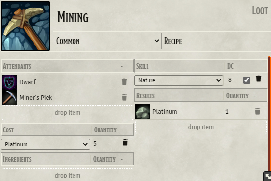
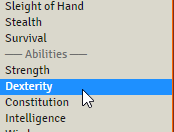
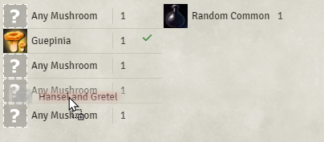
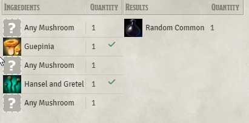

# Changelog
## 2.3.x feature system independent
## 2.3.2 fix tools
fixed: using tools was completely broken.
(tools are deprecated dnd5e only)
## 2.3.1 bug pulling items from compendium
fixed: when dropping items from compendium they no longer have an itemType thus they will not be detected correctly as equal to any item on actor.

fixed: when one recipe refers to an item no longer in this world you could not open the compendium browser
## 2.3.0 feature system independent

⚠️This module now depends on other modules to work, you need to enable them ⚠️

This module can now run on multiple systems. 
It is implemented against [Beaver's System Interface](https://github.com/AngryBeaver/beavers-system-interface),
so this module does not have any code to run on your system.

In order to make this module work on your system, all you need is a tiny bsa-x implementation that maps the interface to your system.
You can write your own or use [existing once](https://github.com/AngryBeaver/beavers-system-interface/wiki/BSA-x-links) others have written.
I start of providing one for [dnd5e](https://github.com/AngryBeaver/bsa-dnd5e) and one for [pf2e](https://github.com/AngryBeaver/bsa-pf2e).

Those adaptions are pretty simple and small but needs some insights about the system. 
So my hope is those playing in a system knowing it can write their own adaptions without me who has no idea about that system.
If not you at least now have this module in pf2e as well.

## 2.2.x feature: Time To Craft
### 2.2.2 workaround for ready set roll
This fix should work for the current version of ready set roll 1.3.14.
Might break at any other version ! a request for more robust interface has been made:
### 2.2.1 fix worldtime is zero
Crafting does not become success when the worldtime is zero.
Sadly I could not automatically fix old crafting processes without breaking unfinished crafting processes.
### 2.2.0 feature: Time To Craft
Crafting becomes a process that you start when clicking on the RecipeCompendium.
The crafting process starts by consuming all resources and fireing up the advanced macro but without granting the results.
When you decide the time to craft is ready you can process the crafting by clicking on the status of the process.
Now the skill check if any is executed and the crafting might end in success or fail. You will get your results and locked resources are freed up if the crafting process allows so.

You can configure the timeToCraft behaviour in the settings section.
Interaction is default it will start the process and waits until you finish the process with your action.
Instantly will switch back to previous mode. you can craft with one click instantly.

#### Time To Craft vs world time automation
E.g. you start the recipe and when the worldtime is advanced by an amount given in the recipe, the crafting completes.

In this first draft I decided against this! As crafting is a downtime activity and passing time does not automatically mean you spend the time on crafting, you might sleep or run for you live from monsters, who knows.


## 2.1.x feature: Crafting tab on actor
### 2.1.2 fix: dnd5e dependent money exchange.
add: system independent money exchange, any system may be implement against an interface.
add: dnd5e exchange implementation.

### 2.1.1 fix: referenced ingredients
fixed: when you do not have given ingredient crafting required the ingredient reference to be valid.

### 2.1.0 feature: Crafting tab on actor
Crafting is now a tab on ActorSheet that shows the history of your crafting processes.
Crafting process can now be serialized and deserialized and thus be stored next to the actor initiating the craft process.
This is the core implementation that will allow future features like time to craft and crafting as downtime process with multiple checks.

## 2.0.x breaking change: extract potions module
### 2.0.1 fix: rerender Recipe Compendium
fixed: when the recipes button is pressed while the window is somewhere open the window will does not popup to front and also does render blank content.
### 2.0.0 breaking change: extract potions module
The example components have moved to an extra module. 
#### why
- potions are dnd5e only and needed a legal term from wizzards of the costs.
- potions have a lot of dnd5e module dependencies and beavers-crafting is currently developed in a direction to maybe allow another system at somepoint.
- some people just wanted potions content without crafting or crafting without potions.
#### breaking:
Previous imported recipes won't work anymore as the resource has moved.

-> You need to import the latest recipse from Beaver's Potions. 

Own recipes that produc the example potions referenced from compendium will not work anymore.

-> delete old potion in recipe and reference new compendium.


## 1.0.x macros
### 1.0.0 feature macros
You can now use macros to customize your recipes further see see [RecipeMacro](https://github.com/AngryBeaver/beavers-crafting/blob/main/macros.md)
You also will find a handful examples solving some user feature requests. 
### 1.0.0 refactored stable
As internal Data is now public available via macro this needed to get refactored in an easy to use and possibly on most parts stable interface leading to version 1.0.0.
Plz note that the internal code is massive refactored basically rewritten hopefully i covered everything to work the same as before, but keep an eye out maybe i missed something.

Hopefully the only difference for the users are 
- chat is now displaying negative quantity on consumed components.
- skillCheck is done regardless of failed components -> because macro can lately decide to fix fails or fail success runs.

## 0.7.x attendants
### 0.7.1 update: identity check
!Breaking Change!
This module intended to match items by a dnd5 core flag "source". Two objects are matching if they have the same name and are from the same source.
Sadly this was broken in various ways. e.g. Using attendants with class, feature or similar imported von dnd-beyond did not work on recipes.

Therefor I changed the identity check of this module to match items when they have the same itemType and name.
A migration script is running the first time you install 0.7.1. fixing all recipes not in compendiums. If you still have broken recipes or you just imported broken recipes from compendium you can fix those with:
````javascript
game['beavers-crafting'].itemTypeMigration()
````
### 0.7.1 update: weaken reference
Recipes do not store the complete Item but a reduced view called Component that has all basic information needed for recipes as well as a reference the uuid.
UUIDs are not unique to items but to the instance. So each copy has a new uuid making it hard to create recipes that can be transfered to other worlds as you also need to transfer the referenced items with the exact same uuid.
Only uuids within compendiums are unique across worlds. That is why I recommend using compendiums in the recipe creation process.

! As of 0.7.1 items no longer need to match the source so you may decouple your recipe from your referenced items.

Components do now also store the itemType for comparing Components to Items. Old Components do not have this property.
You can fix your existing recipes (not compendium recipes)
````javascript
game['beavers-crafting'].itemTypeMigration()
````
Meaning you can copy your recipes to another world witch does not have the original sources your recipes needed, but instead any instance with the same name and type.
This does only work for Attendants and Ingredients that are not of type "AnyOf". (may come later)
For results you still need the original item as this is copied over to the actor. (complete items are not stored but components)

Keep in mind that you can not click and show up the item descriptor of Ingredients, Attendants that are not also imported into the new world. You can disable this setting: "display ingredient sheet"
### 0.7.1 feature: own recipes
Your RecipeCompendium now contains also the recipes the user owns e.g. are in his inventar. You can also filter for own recipes only.

### 0.7.0 feature optional attendants
You now are able to create recipes with attendance that are items, features, tools or classes that are required in the craft process but not consumed.




This enables completly diffrent kinds of recipes like e.g. mining or gathering
that requires certain items like sickle or backgrounds like Farmer etc...

### 0.7.0 feature add abilities as skillCheck



### 0.7.0 bug: "missing tools check when ingredients are not available" fixed
### 0.7.0 bug: "consume costs on failed check while recipe requirements are not fullfilled" fixed
### 0.7.0 bug: "roll skill with insufficient requirements" fixed

## 0.6.x customized AnyOf
### feature customized AnyOf ingredient
You now are able to customize recipes that uses anyOf Ingredients,
and by doing so define what specific ingredients you want to use for this recipe.




- drag and drop an ingredient (e.g. from your inventar) to "anyOf" ingredient within your recipeCompendium.
- it will automatically check if that new ingredient is available in that quantity.
- it will stack same (identity same!) ingredients.
- when you reselect the recipe it will remove your customization and start over with anyOf Items again.

### bug: "selection of recipe is not shown as selected." fixed
### bug: "click ingredient or result will only work on first recipe" fixed

## 0.5.x feature tool
you now can use tools, if you do not have the tool you dont get a check you simple fail and your ingredients won't vanish.
## 0.4.x feature compendiums,
you now can use items directly from compendium,
module comes with 4 compendiums ingredients,rolltables,potions and recipes
## 0.3.x feature add initial anyOf ingredient
you now can have anyOf ingredients
breaking change 0.2.x -> 0.3.x
## 0.2.x feature add rollTable result
you now can produce a random Potion.
breaking change 0.1.x -> 0.2.x
